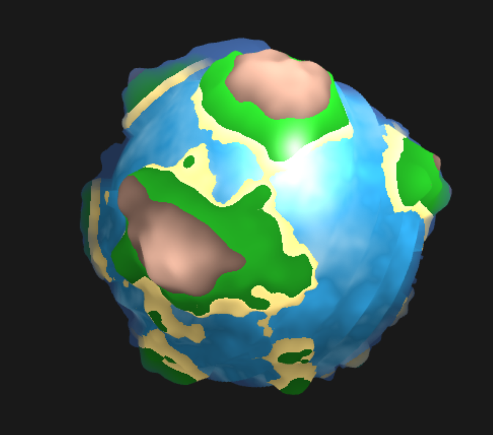
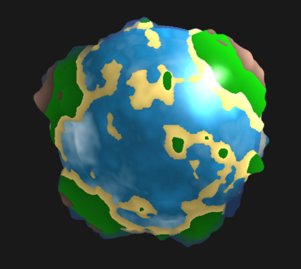

# Salaar Kohari - Procedural Shaders

## About
- Custom procedural shaders made with WebGL and TypeScript
- Created for CIS 566 - Procedural Computer Graphics
- Salaar Kohari (PennKey: salaar)

## Planet Shader
The shader uses a Blinn-Phong model for specular lighting, with higher intensity on the water than on land. A 4D Simplex noise function (based on 3D position and time) clamped to prevent valleys and combined with Fractal Brownian Motion creates the land heightmap. Another 4D Simplex noise function is used to create color highlights in the water. Subtle land highlights are height-based. Distance fog occurs on the horizon of the planet, regardless of viewing angle. The user can tweak sunlight intensity and fog color.

## Running the Code

1. [Install Node.js](https://nodejs.org/en/download/).

2. Using a command terminal, run `npm install` in the root directory of your project.

3. Run `npm start` and then go to `localhost:5660` in your web browser

## Resources
- Javascript Modules https://developer.mozilla.org/en-US/docs/Web/JavaScript/Reference/Statements/import
- Typescript https://www.typescriptlang.org/docs/home.html
- dat.gui https://workshop.chromeexperiments.com/examples/gui/
- glMatrix http://glmatrix.net/docs/
- WebGL https://developer.mozilla.org/en-US/docs/Web/API/WebGL_API
- Noise Functions https://github.com/ashima/webgl-noise